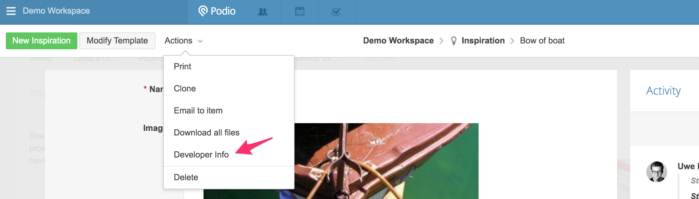
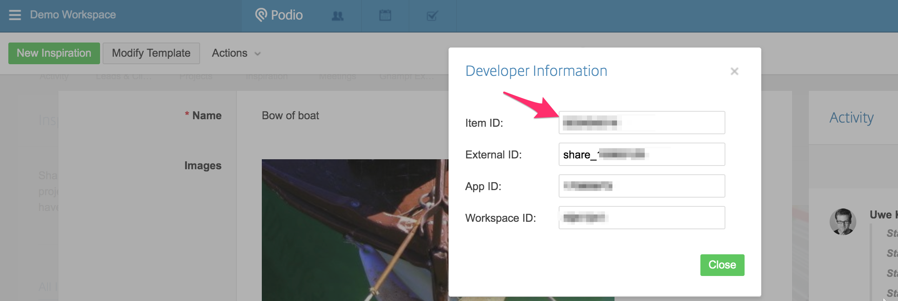

# Tetrapod

## How to install

```
pip install -e git+https://github.com/uwekamper/tetrapod.git#egg=tetrapod
```

## the 'tpod' command

Get your client ID und client secret from https://podio.com/settings/api

Then run the following command:

```
tpod init --client-id=<Podio-client-id> --client-secret=<Podio-client-secret>
```

This will create a hidden file called `.tetrapod_credentials.json` in the
current working directory. The access token is valid for some hours.

## Accessing single Podio items

You can find die `item_id` of any Podio item by opening a Podio item detail view
in the Webbrowser and then clicking on 'Actions' and 'Developer info':



This will display among other things the item_id and the app_id:



Using the item_id you can now write a simple python programm that will read the details
of one single item:

```python
from tetrapod.session import create_podio_session

ITEM_ID=123456789 # <- Replace with your own item_id.


def get_podio_item(item_id):
    # reads the access token from .tetrapod_credentials.json
    podio = create_podio_session()

    # see https://developers.podio.com/doc/items/get-item-22360
    item_url = f'https://api.podio.com/item/{item_id}'

    # podio.get() works almost the same way that requests.get() works
    resp = podio.get(item_url)
    resp.raise_for_status()
    item_data = resp.json()
    return item_data


if __name__ == '__main__':
    item_data = get_podio_item(ITEM_ID)
    # print something from the item_data, then exit
    print(f"Item-ID: {item_data['item_id']}")
    print(f"Item title: {item_data['title']}")

```

Now run the program. The output should look like this:

```bash
$ python ./get_item_data.py
Item-ID: 123456789
Item title: Bow of boat
$ _ 
```


## Useful links
+ https://github.com/finklabs/whaaaaat
+ http://click.pocoo.org/5/
+ https://github.com/asweigart/pyperclip
+ http://urwid.org/
+ http://npyscreen.readthedocs.io/introduction.html
+ https://help.podio.com/hc/en-us/community/posts/206886967-Updating-a-Calculation-Field-Script-via-the-API
+ https://requests-oauthlib.readthedocs.io/en/latest/
+ https://sedimental.org/glom_restructured_data.html
